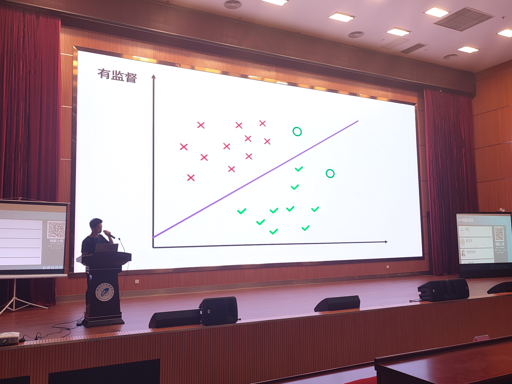
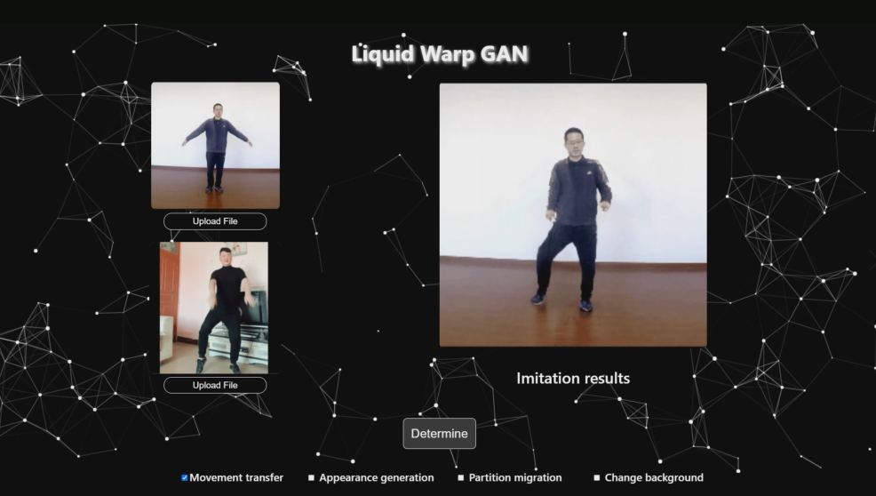
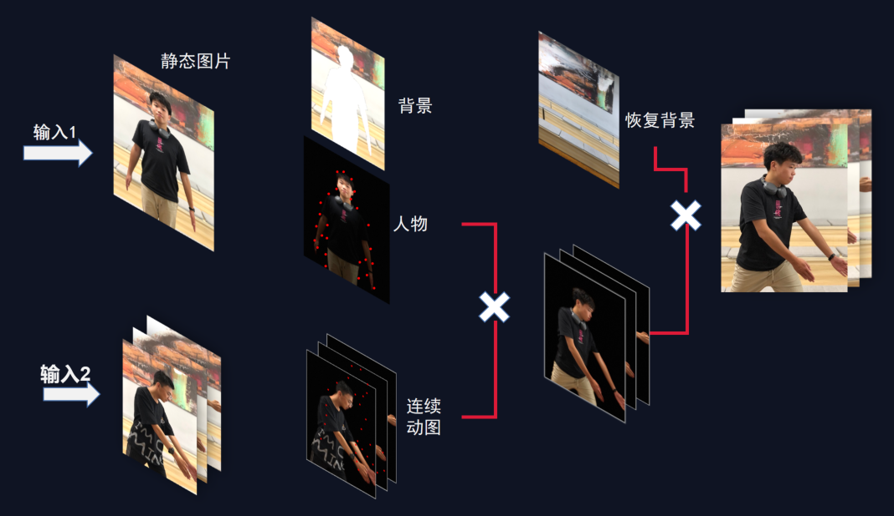
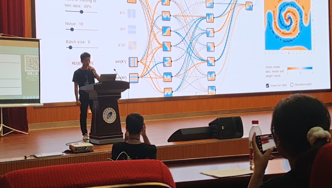

# About🐶

This repository is about my work for summer vacation assessment of kexie.

The Liquid Warping GAN is my research direction.

I will read papers to get a deeper understanding about it,and try my best to improve it better!

✈️This repository is my study blog and I will keep update it.

# Liquid-Warping-GAN

Liquid-Warping-GAN is a GAN which integrates Illustration of human motion imitation, appearance transfer and novel view synthesis into one.

The funny of it is the reason for me to choice it .The birthday of this repository👶

🍼2021/6/28 create this repository

- create the Baseline_Study and Idear to put basic learn about the Liquid warping GAN and my idea about import it in the future respectively
- I update the Liquid Warping GAN Code interpretation ,Liquid Warping GAN Paper transfore,Pix2Pix架构,SMPL,关键点检测 to Baseline_Study.
- I update the Idea to Idear.

They are all my note before 2021/6/28

# Introduction

Liquid Warp GAN 是一个基于GAN的无监督动作迁移，顾名思义就是动作的模仿。用机器学习让照片跳舞。一张图片，一个视频就能让你跟着影流之主摆动。
		动作迁移过程可以分为三个阶段，第一阶段采用HMR的姿态检测模块，得到3D人体姿态关节关键点。第二个阶段通过3D人体姿态关键点得到相关的放射变换，得到模仿的人体姿态动作图。采用U2GE-net显著性检测网络，得到抠图后的背景图，通过图像修补网络得到虚拟的背景图。最后在第三个阶段，将人体姿态图虚拟背景图融合，得到最终的模仿效果。
鬼畜，我是专业的！

# End

暑假考核已经结束了，过程曲折，验收也很曲折，邯郸学步的答辩差点把我整没了。。。

The Video is save in the Video floder.

由于作品的趣味性，最后也在科技交流会上进行演讲。第一次上这么大的场面还是挺高兴的。

## Thanks for the XiaoWei change my ugly background of the front-end.

## Thanks for the Siri modified my poor PPT and added some nice animation

## Thanks for Maiweiliang and Sangzhiqi were shoot for my Speaking.

## Thanks for Luchang and Siri gave some modification suggestions to my manuscript.

## Thanks for friends take pictures or videos of me.

## :kissing_heart:Thanks for everyone who intentional or unintentional help in my growth.Thank you for having you all the way

2021年12月12日20:18:58

# Noice
如果你也想试试魔法，可以关注https://github.com/iPERDance/iPERCore这，是Liquid-Warping-GAN的改进版，效果更好，泛化性更强（2021年）。

If you have a situation where latex can't render 

Please click [Here](https://chrome.google.com/webstore/detail/mathjax-plugin-for-github/ioemnmodlmafdkllaclgeombjnmnbima/related?hl=zh-CN) and download this plug.

